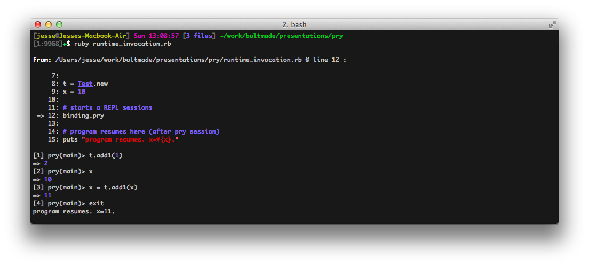
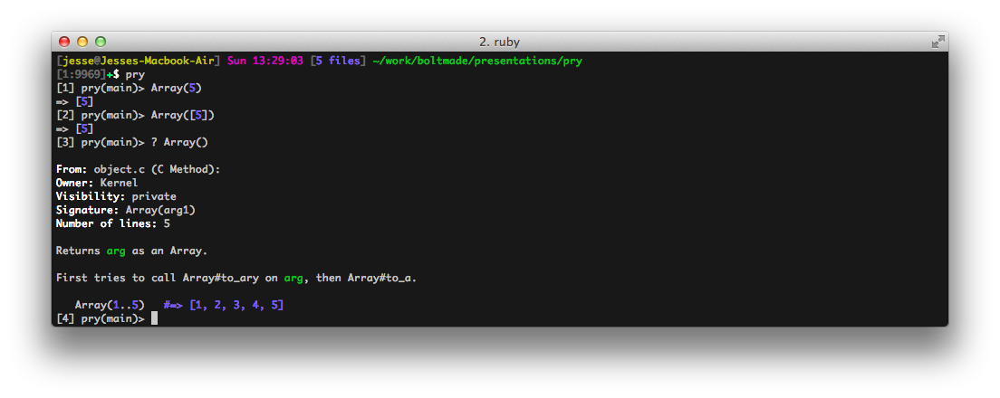
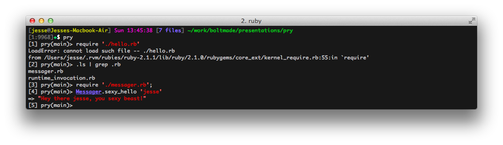

# [fit] Prying into Ruby
### _**@elsom25**_ | Boltmade
---

> Pry is a powerful alternative to the standard IRB shell for Ruby.
-- pryrepl.org

---

## runtime invocation

---

---

## documentation exploration

---

---

## shell commands and hiding output

---

---
# [fit] Understanding Money
# [fit] _**let's dive deep and explore some library code**_
---

So I want to add a "reversible" `exchange_to` method to `Money`

The goal is for:

    10.to_money('USD').reversible_exchange_to('CAD').exchange_to('USD')
    => 10.to_money('USD')

---

So to start, let's see what `exchange_to` is doing under the hood:

    pry
    require 'money';
    cd Money
    $ exchange_to

---

Okay, so that doesn't do much, digging deeper:

    ls
	cd default_bank
    $ exchange_with

There's the gold! We want to replace `get_rate` with a `get_reversible_rate`

---
# [fit] It doesn't work!
---

we'll throw a `binding.pry` in our custom implmentation and see what went wrong!

play with `next` and `step`

---
# Cool extras
---

- pry-rescue
- pry-stack_explorer
- better_errors
- pry-debugger
- pry-plus
- pry-rails

---

# Questions?

---

jesse@boltmade.com

boltmade.com
